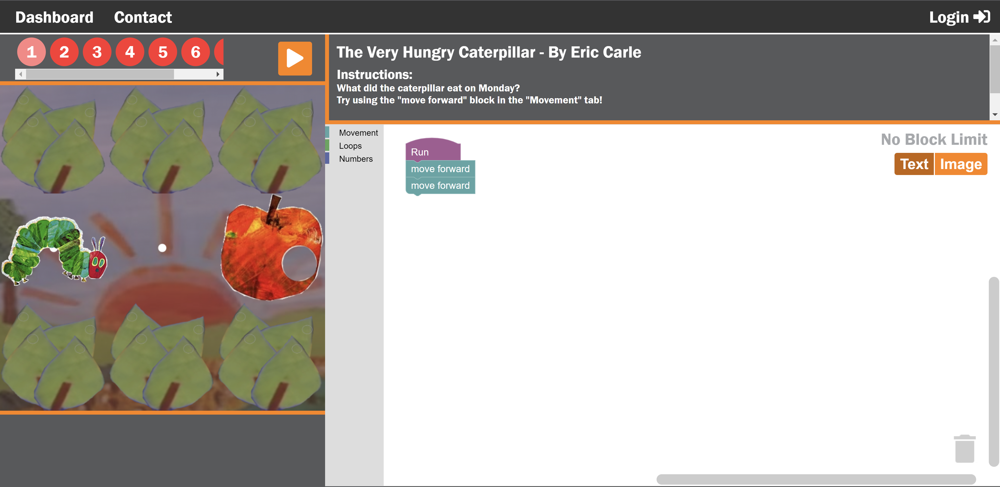

# Code a Story

## University of Tennessee Knoxville / Research SP2021 - SP2022, SP2023
### Dr. Amir Sadovnik, Jovan Yoshioka

A web-based application that integrates coding into existing K-5 English curriculum via challenges for schools that lack dedicated computer science programs. The challenges are mazes based on stories' plots that must be traversed using block-based code. Students are able to advance not only their literary sequencing and comprehension abilities, but also their computer science skills in a challenging, yet fun way. Customizability is implemented as much as possible to adhere to teachers' specific needs.

Code a Story is a part of Computer Science for Appalachia (CSA), an NSF-funded "research-practice partnership to integrate computer science into rural East Tennessee schools." For more information, visit: https://sites.google.com/vols.utk.edu/csa

Check out the documentation [here](https://github.com/jovanyoshioka/Code-a-Story/blob/master/documentation.pdf)!

Try it out yourself [here](https://codeastory.utk.edu/pages/dashboard.php)!

Block-based coding implemented with Blockly, Google's open-source library.
Icons provided by Font Awesome, License: https://fontawesome.com/license